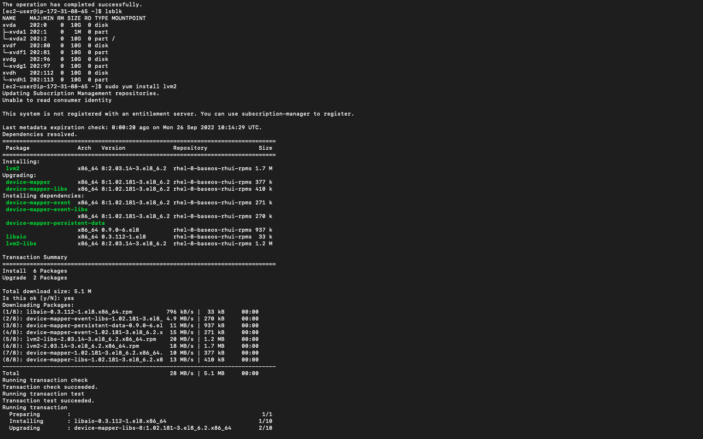
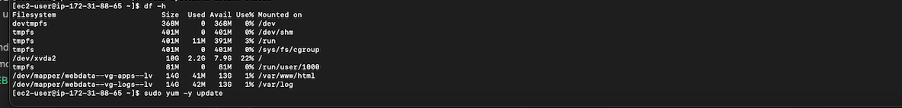
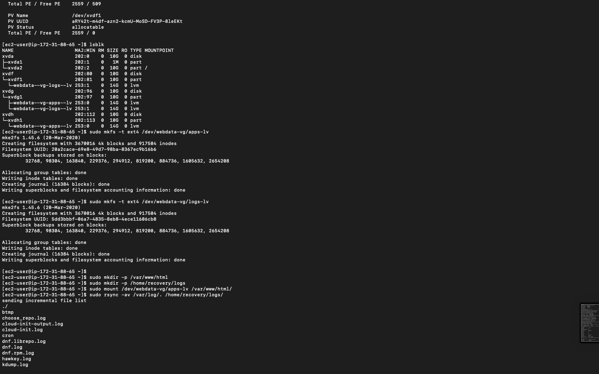
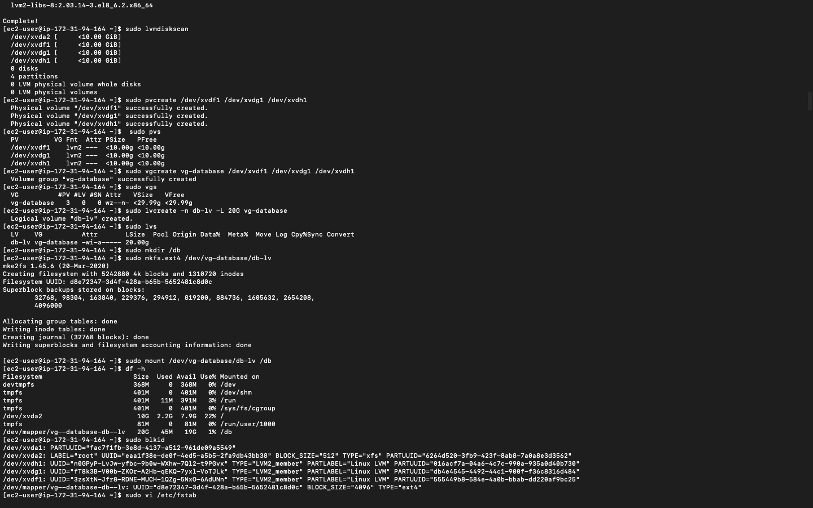
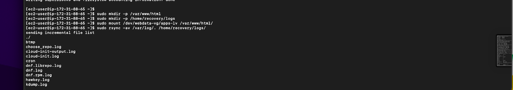
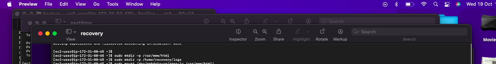
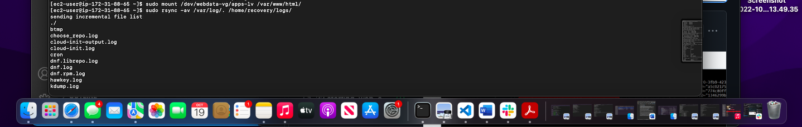
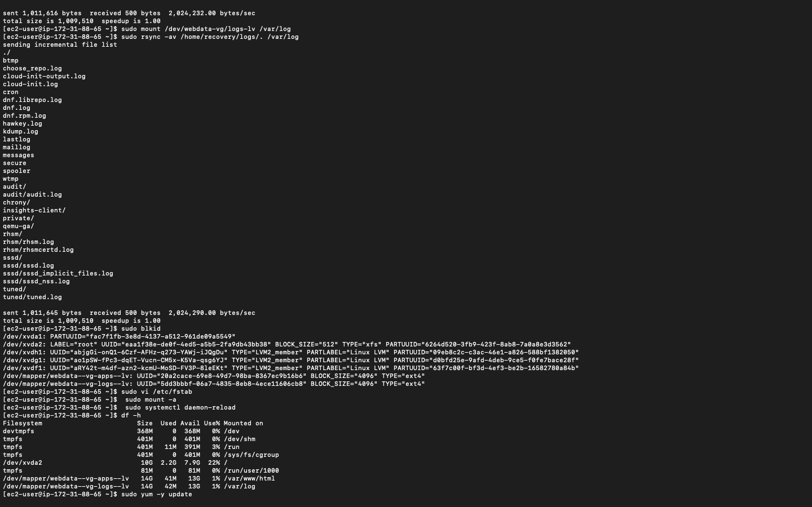

Implementing-Wordpress-Web-Solution

 ## STEP1 Preparing Web Server

 - Create a EC2 instance server on AWS 

 - On the EBS console, create 3 storage volumes for the instance. This serves as additional external storage to our EC2 machine

 

 - Attach the created volumes to the EC2 instance 

 

 - SSH into the instance and on the EC2 terminal, view the disks attached to the instance. This is achieved using the `lsblk` command.

 


 - To see all mounts and free spaces on our server

 

 - Create single partitions on each volume on the server using `gdisk `

 
 


 - Installing LVM2 package for creating logical volumes on a linux server.

 

 - Creating Physical Volumes on the partitioned disk volumes <br/>
 `sudo pvcreate <partition_path>`

 


 - Next we add up each physical volumes into a volume group <br/>
 `sudo vgcreate <grp_name> <pv_path1> ... <pv_path1000> `

 

 - Creating Logical volumes for the volume group <br/>
 `sudo lvcreate -n <lv_name> -L <lv_size> <vg_name>`

 


 - Our logical volumes are ready to be used as filesystems for storing application and log data.
 - Creating filesystems on the both logical volumes

 


 - The apache webserver uses the html folder in the var directory to store web content. We create this directory and also a directory for collecting log data of our application

 

 - For our filesystem to be used by the server we mount it on the apache directory . Also we mount the logs filesystem to the log directory

 

 - Mount logs logical volume to var logs


 - Restoring back var logs data into var logs

 

 ## Persisting Mount Points
 - To ensure that all our mounts are not erased on restarting the server, we persist the mount points by configuring the `/etc/fstab` directory

 - `sudo blkid` to get UUID of each mount points

 

 - `sudo vi /etc/fstab` to edit the file

 

  - testing mount point persistence

 

 ## STEP2 Preparing DataBase Server
  - Repeated all the steps taken to configure the web server on the db server. Changed the `apps-lv` logical volume to `db-lv`

 

 ## STEP3 Configuring Web Server
 - Run updates and install httpd on web server
 ```
 yum install -y update
 sudo yum -y install wget httpd php php-mysqlnd php-fpm php-json
 ```

 - Start web server

 

 - Installing php and its dependencies
 ```
 sudo yum install https://dl.fedoraproject.org/pub/epel/epel-release-latest-8.noarch.rpm
 sudo yum install yum-utils http://rpms.remirepo.net/enterprise/remi-release-8.rpm
 sudo yum module list php
 sudo yum module reset php
 sudo yum module enable php:remi-7.4
 sudo yum install php php-opcache php-gd php-curl php-mysqlnd
 sudo systemctl start php-fpm
 sudo systemctl enable php-fpm
 setsebool -P httpd_execmem 1
 ```

 - Restarting Apache: 
 `sudo systemctl restart httpd`

 - Downloading wordpress and moving it into the web content directory
 ```
 mkdir wordpress
 cd   wordpress
 sudo wget http://wordpress.org/latest.tar.gz
 sudo tar xzvf latest.tar.gz
 sudo rm -rf latest.tar.gz
 cp wordpress/wp-config-sample.php wordpress/wp-config.php
 cp -R wordpress /var/www/html/
 ```

 - Configure SELinux Policies
 ```
 sudo chown -R apache:apache /var/www/html/wordpress
 sudo chcon -t httpd_sys_rw_content_t /var/www/html/wordpress -R
 sudo setsebool -P httpd_can_network_connect=1
 ```
 - Starting database server

 

 ## STEP4 Installing MySQL on DB Server
 ```
 sudo yum update
 sudo yum install mysql-server
 ```

 To ensure that database server starts automatically on reboot or system startup
 ```
 sudo systemctl restart mysqld
 sudo systemctl enable mysqld
 ```

 ## STEP5 Setting Up DB Server
 

  - Ensure that we add port `3306` on our db server to allow our web server to access the database server.

 

 ## Connecting Web Server to DB Server

 Installing mySQl client on the web server so we can connect to the db server

 ```
 udo yum install mysql
 sudo mysql -u admin -p -h <DB-Server-Private-IP-address>
 ```
 

 - On the web browser, access web server using the public ip address of the server 

 